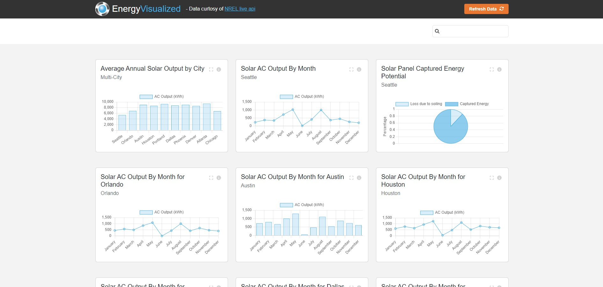
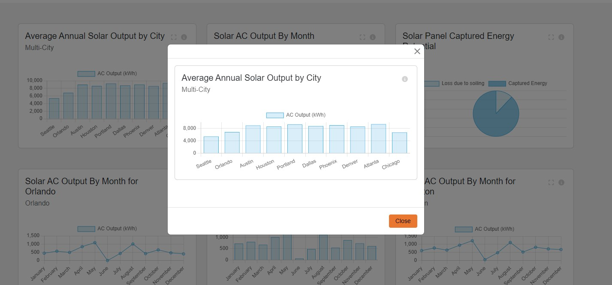
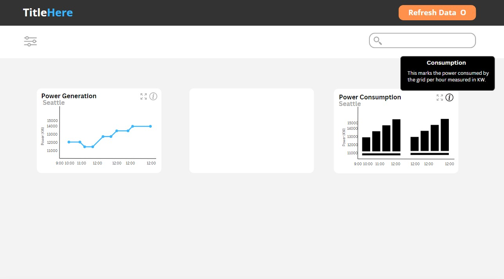
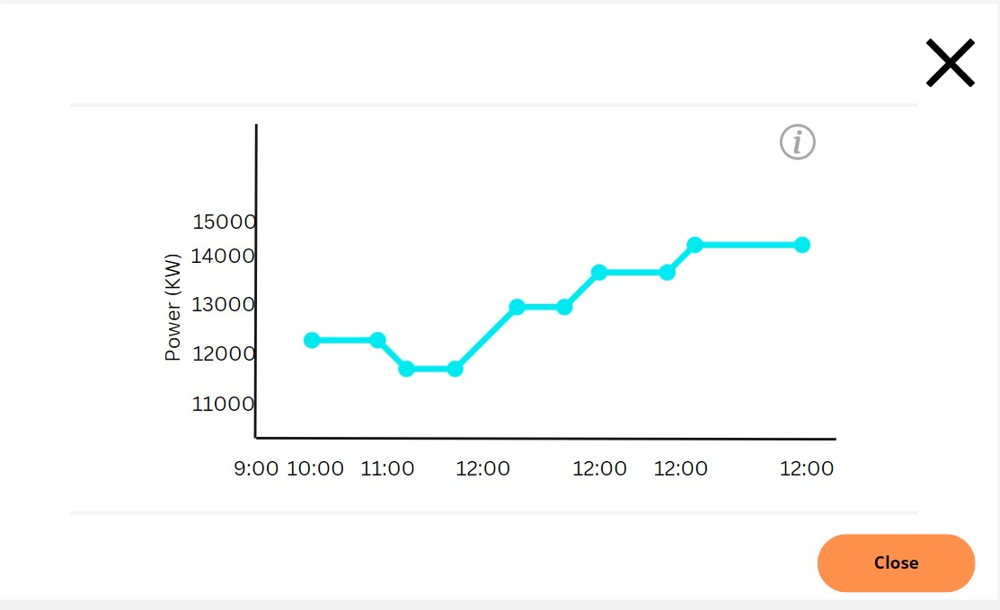

# Responsive Dashboard Project

## Dashboard

## Modal View

## Project Overview

### Purpose

The goal of this project is to create a responsive dashboard using React and Chart.js that displays data in various formats.

### Requirements

- Integrate Chart.js with React to display at least three different types of charts.
- Ensure the dashboard is responsive and works well on both desktop and mobile devices.
- The design should be clean and user-friendly.

## Approach

### Initial Setup

#### Tools and Libraries:

- **React** for building the user interface.
- **Chart.js** for creating charts.
- **Vite** for project setup and build tool.
- **Babel** for transpiling JavaScript for older browsers.
- **Bootstrap** and **SASS** for modern CSS practices.
- **Redux Toolkit** for modern state management.

#### Project Initialization:

- Used `npm create vite@latest` to initialize the client folder of the project.
- Configured Vite to use Babel when compiling React code into vanilla JavaScript.
- Created a server directory for a simple Node.js Express server for hosting and API integration.
- Configured Vite frontend to proxy requests to the localhost server port during development.
- Configured the server to serve static frontend files and handle single frontend requests for API information.
- Configured the server to use `helmet.js` for automatic essential security header setting.
- Setup `dotenv` for secure storage of API keys to avoid exposure in source code or repository.
- Used `npm install` to install Bootstrap, Chart.js, react-chart.js-2, react-redux, @reduxjs/toolkit, fontawesome (icons), sass (modern CSS practice), axios, express, and dotenv.
- Setup and imported Sass files to import Bootstrap and override key values such as primary and secondary theme colors.

## Design and Layout

### Wireframe:

The layout includes a header, a “filter” section for searching and future filtering options, a main content area for displaying charts, and a modal for larger chart viewing.

### Responsive Design:

- Utilized Bootstrap Container and Grid tools along with Flexbox for layout and responsiveness.
- Utilized Bootstrap component display control to remove less-essential content on smaller screens.

## Implementation

### Data Integration:

- Initially used static data when setting up site layout and chart placement.
- Integrated NREL API to pull live energy data on 10 cities.

### Chart Types:

- **Line Chart** for city-specific solar energy capture rate trends over a 12-month period.
- **Bar Chart** for comparison of annual capture rates between various cities.
- **Pie Chart** for displaying city-specific portions of captured solar energy potential vs loss due to soiling (dust, dirt, etc.).

### State Management:

- Managed state using Redux Toolkit and React’s useState hook.
- Passed state props as needed due to smaller codebase size.

### Interactivity:

- Added expand and tooltip options for higher-resolution understanding of chart data.
- Added search functionality that filters based on chart title and cities used in a given graph.
- Added option to refresh the data pulled from the API (although there is a simple caching layer to limit API call number).

## Testing and Deployment

### Testing:

- Performed manual testing on various devices (desktop, tablet, mobile).

### Deployment:

- Configured the application and deployed to Render.com as a web service.

## Challenges and Solutions

### Challenge: Chart Responsiveness

- **Problem**: Ensuring charts were responsive on all devices.
- **Solution**: Used Bootstrap responsive grid to control charts-per-row at a given viewport width.

### Challenge: Implementing unique data set from API

- **Problem**: The schema that Chart.js expects and the data supplied by the API were vastly different.
- **Solution**: Created a parsing function (convertData) that pulls relevant data from the returned API data and produces a Chart.js-friendly object structure.

### Consideration:

- Keeping the schemas orderly was difficult due to their complexity. Using TypeScript for a data-intensive project such as this could have presented significant advantages.

### Challenge: Implementing DRY programming for various charts

- **Problem**: Different chart types expect and require different inputs and configuration.
- **Solution**: Implement ternary and conditional measures to produce correct data and structure for different chart types.

### Consideration:

- Implementing DRY programming here ended up being quite intrusive and intensive. There could be some advantages to not implementing full-DRY practices here and duplicating some logic to make the program easier to understand.

## Future Improvements

### Interactivity

- More manual filters other than searching.
- Chart-specific tools for changing city, metrics, etc. on a specific chart.
- Implement logic to support multi-word city names. Currently, the app handles one-word city names.
- Add a “pinning” feature to allow specific graphs to always be displayed first.
- Add additional API integration to increase the number of chart types. The data from the single API serves for Line, Bar, and Pie charts only. Other API data would be needed to justify the usage of other chart types.

### Move to TypeScript

- For a small app, JavaScript is the quick and doable option here. For a larger app, complex schema management would be easier to handle with TypeScript.

### Implement Vitest Unit Testing

## Conclusion

This project demonstrates the ability to create a responsive dashboard using React, Chart.js, real-world data, and a handful of modern frontend technologies. Future improvements could include integrating more interactive features and views of data.
